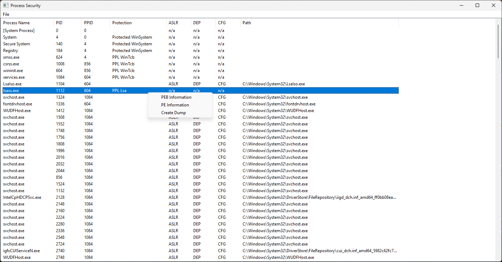
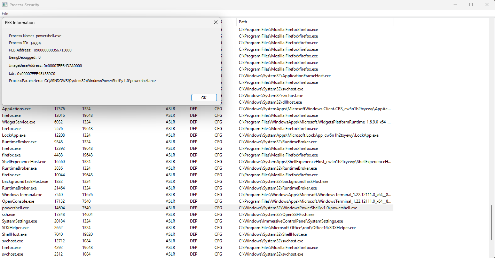
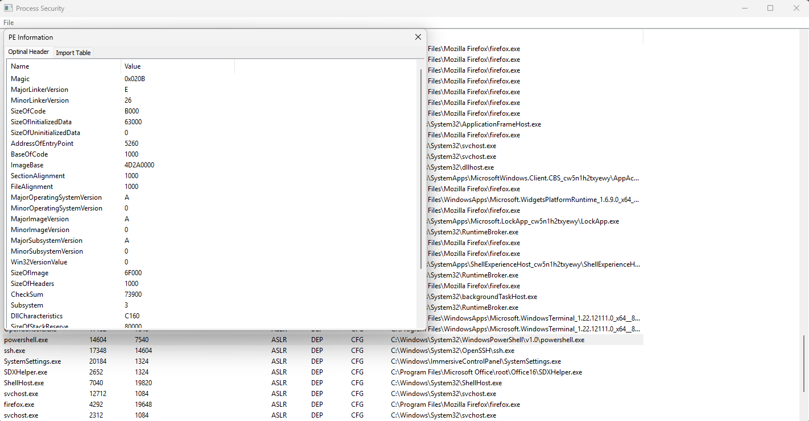

# ProcSec (process Security)

ProcSec is a lightweight educational Windows tool for exploring running processes and learning Windows internals.

This project was created to practice Windows API programming, GUI development, and process inspection techniques. It is not intended to be a full security product, but rather a research and learning project.

⚠️ This is an early version and the project is actively under development.

---

## 📷 Screenshots

---

## 🚀 Features

- List running processes
- Display PID / PPID
- Show basic process protection level
- Display process mitigation policies (CFG, ASLR, DEP)
- Dump process memory (educational purpose)
- Show simplified PE information
- Basic PEB inspection
- GUI interface written with Visual Studio 2022

---

## 🎯 Purpose

The goal of this project is learning:

- Windows API programming
- Process and memory inspection
- PE structure basics
- PEB exploration
- Mitigation awareness
- GUI programming on Windows
- Reverse engineering related fundamentals

This tool is designed for students, researchers, and developers interested in Windows internals.

---

## ⚠️ Status

Version: v1 (initial release)

This software is incomplete and experimental.  
Features will change and expand over time.

Expect bugs, missing functionality, and breaking updates.

---

## 🛠 Build

- Visual Studio 2022
- Windows x64 target recommended
- Native Win32 project

Open the solution file in Visual Studio and build normally.

---

## ⚖️ Disclaimer

This project is provided strictly for educational and research purposes.
The author is **not responsible** for misuse, damage, or illegal activity caused by this software.
Use responsibly and only on systems you own or are authorized to analyze.

---

## 📜 License

MIT License

---

## 👤 Author

Developed by **Abolfazl**

Telegram: [@FallinBinary](https://t.me/FallinBinary)